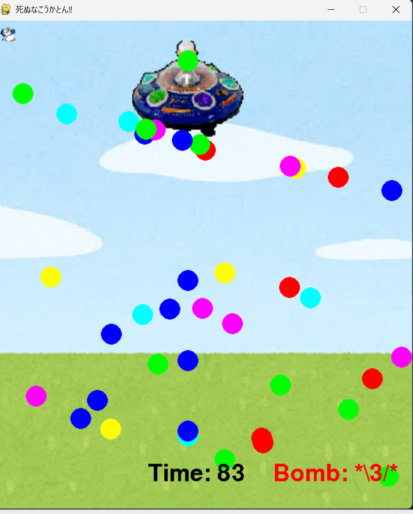

# 死ぬなこうかとん‼

## 実行環境の必要条件
* python >= 3.10
* pygame >= 2.6.1

## ゲームの概要
* 主人公こうかとんが敵の攻撃を避け続ける弾幕シューティング型の耐久ゲームで、3分間敵の猛攻をこうかとん唯一の攻撃方法であるボムを駆使して生き延びるゲームです。

## ゲームの遊び方
* 矢印キーでこうかとんを操作し，Bキー押下でボムを発動(最大3回)、敵の攻撃を一掃できます(敵にダメージは与えられません)
* こうかとんの画像に敵の攻撃が当たるとゲームオーバーです。

## ゲームの実装
### 共通基本機能
* 背景画像と主人公キャラクターの描画
* 主人公の移動・敵攻撃の仮表示
* 敵攻撃とこうかとんの当たり判定

### 分担追加機能
* (担当：田中)ボム機能の実装：Bキー押下で敵の攻撃を一掃した後、回数を一回減らす(最大３回)
* (担当：一宮)敵と攻撃の表示：敵の貼り付けと、敵の攻撃の形状決定と貼り付け
* (担当：矢崎・宮木)敵の攻撃の実装(２形態分)：各自1分半の間の敵の攻撃方法の決定・実装
* (担当：伊藤・飯島)mein関数の実装：具体的なゲームシステムの制作・クリア画面、ゲームオーバー画面の実装
* (担当：矢崎)コードの最終確認・細かい仕様の最終決定

### ToDo
- [ ] 攻撃形態第３形態の実装
- [ ] こうかとんの画像の中心にある円の実装(当たり判定の変更)
- [ ] BGMの追加

### メモ
* それぞれのクラスは各自で似たような変数を用いる
